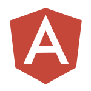

<h1>&nbsp; Don Livingston </h1>
## Web & UI/UX Developer • Digital Craftsman • Tech Enthusiast • AWS Community Builder

Hi! I'm Don Livingston. I am a Professional Web & UI/UX Developer and Full-Stack Digital Craftsman with over 12 years of experience. I specialize in producing clean, readable, maintainable code, as well as attractive and usable web designs. My personal aptitude is in balancing the "right-brained" creative concerns of User Interface Design with the "left-brained" logical and analytic discipline of Development.  

* 🌍  I'm based in New Jersey (NYC Metro Area)
* 🖥️  See my portfolio at [DonaldLivingston.com](http://donaldlivingston.com)  
* 🧠  I'm learning Everything JavaScript  
* 🤝  I'm open to collaborating on interesting projects
* ⚡   Fun Fact: Whenever I eat Cheetos, I use chopsticks so I don't get cheese dust on my fingers (and everywhere else 😉)

&nbsp;

## Skills and Technologies

### Front End

 
  &nbsp;
  &nbsp;
  &nbsp;
  &nbsp;
  &nbsp;
  &nbsp;
  

### JS Frameworks

  &nbsp;
  &nbsp;
  &nbsp;
  &nbsp;
  &nbsp;

 

### Back End

  &nbsp;
  &nbsp;
  &nbsp;
  &nbsp;
  

 

### Design Tools

  &nbsp;
  &nbsp;
  &nbsp;
  &nbsp;
  &nbsp;

 

 ## Connect with Me! 👋 
 
 

  &nbsp;
  &nbsp;
  &nbsp;
  &nbsp;
  &nbsp;
  &nbsp;
  &nbsp;
  &nbsp;
  &nbsp;
  &nbsp;
  &nbsp;
  &nbsp;
  &nbsp;
  

<!---
dlivingston/dlivingston is a ✨ special ✨ repository because its `README.md` (this file) appears on your GitHub profile.
You can click the Preview link to take a look at your changes.
--->
